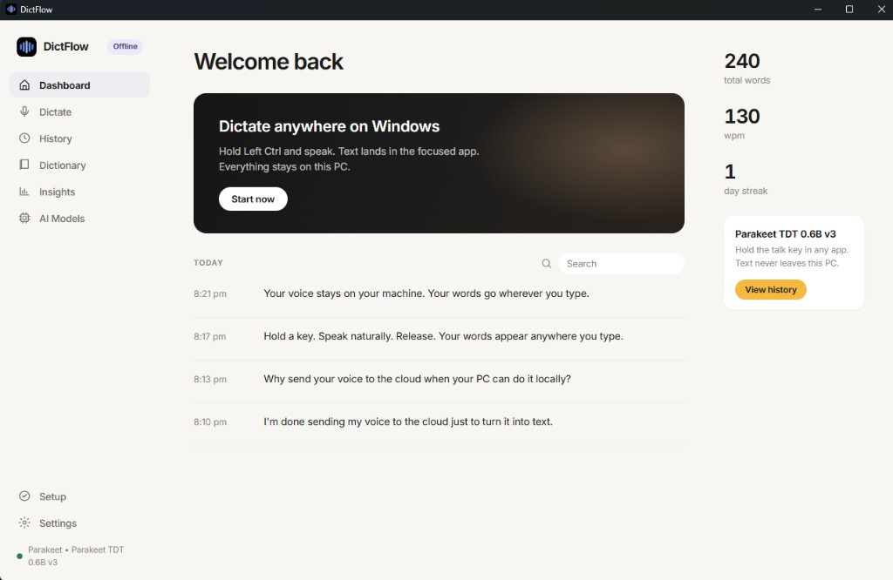

# DictFlow

Offline voice dictation for Windows 10/11. Hold a key, speak, release —
text lands in whatever app has focus.

Your voice stays on your machine. Your words go wherever you type.
Nothing leaves your PC unless you turn on an optional online model.



**Latest:** [v0.2.0](https://github.com/vk-maurya/dictflow/releases/tag/v0.2.0)

## Download

| File | Use this when |
|---|---|
| [DictFlow_0.2.0_x64-setup.exe](https://github.com/vk-maurya/dictflow/releases/download/v0.2.0/DictFlow_0.2.0_x64-setup.exe) | Installer (recommended). Start Menu, current-user install, uninstall. |
| [DictFlow-0.2.0-windows-x64-portable.exe](https://github.com/vk-maurya/dictflow/releases/download/v0.2.0/DictFlow-0.2.0-windows-x64-portable.exe) | No installer. Double-click to run. |

[All releases](https://github.com/vk-maurya/dictflow/releases)

The builds are unsigned, so Windows SmartScreen may warn. Choose
**More info → Run anyway**.

Portable is not a USB-only copy: settings, models, and history still live in
`%APPDATA%\com.dictflow.app\dictflow`.

## First run

1. Download the installer or the portable exe above.
2. Open DictFlow. Allow the microphone if Windows asks
   (Settings → Privacy & security → Microphone → desktop apps).
3. Open **AI Models** and download **Parakeet TDT 0.6B v3** (~670 MB, one time).
4. Click into any text field (browser, editor, chat).
5. Hold the talk key, speak, release. Text is pasted into the focused app.

Default talk key is **Right Ctrl**. Change it in **Settings** to Left Ctrl,
Scroll Lock, F9, or Ctrl+Alt+Space. Hold-to-talk or toggle.

Confirm the mic in **Setup** if a take is silent.

## What you get

- **Offline by default** — Parakeet runs in-process. After the model
  download, dictation does not need the network. No account, no telemetry.
- **Two local engines** — Parakeet TDT 0.6B v2 (English) and v3 (25
  languages); Whisper tiny/base/small via an optional whisper.cpp sidecar.
- **Optional online** — OpenAI-compatible speech (for example Groq) and an
  optional LLM polish pass. API keys stay in Windows Credential Manager.
- **Talk key** — hold or toggle; cancel with Esc or another key while held.
- **Cleanup** — dictionary snippets, spoken punctuation, filler-word cleanup,
  smart trailing punctuation.
- **App** — Dashboard, Dictate, History (with playback), Dictionary,
  Insights, AI Models, Setup, Settings. Tray icon, auto-start, update check.

## Permissions

- **Microphone** — Windows Settings → Privacy & security → Microphone →
  *Let desktop apps access your microphone*. Use **Setup** to test devices.
- **Auto-paste** — no extra grant on Windows (no Accessibility prompt).

## Build from source

For contributors. End users can skip this and use the downloads above.
Full environment notes: [docs/BUILD.md](docs/BUILD.md).

```powershell
npm install
npm run tauri dev
```

Then download Parakeet v3 in **AI Models** and hold the talk key.

Release build (installer + portable):

```powershell
powershell -ExecutionPolicy Bypass -File scripts\build-windows.ps1
```

## Documentation

- [docs/BUILD.md](docs/BUILD.md) — toolchain, daily commands, troubleshooting
- [docs/RELEASE.md](docs/RELEASE.md) — versioning and GitHub releases
- [docs/ARCHITECTURE.md](docs/ARCHITECTURE.md) — pipeline, threads, storage

## Project layout

```
src/                 # Web UI (TypeScript + Vite, no framework)
src-tauri/           # Rust backend (Tauri v2)
  src/main.rs        # state, commands, hotkeys, tray
  src/models.rs      # model catalog (both engines)
  src/text.rs        # offline text pipeline (dictionary, cleanup, punctuation)
assets/              # screenshot, logo source (logo-512.png)
scripts/             # build-windows.ps1, package-portable.ps1, clean-dev.ps1
docs/                # build / release / architecture notes
```

## Contributing

See [CONTRIBUTING.md](CONTRIBUTING.md). Before a PR: `npm run build`,
`cargo clippy --manifest-path src-tauri/Cargo.toml -- -D warnings`,
and `cargo test --manifest-path src-tauri/Cargo.toml`.

## License

MIT — see [LICENSE](LICENSE).
